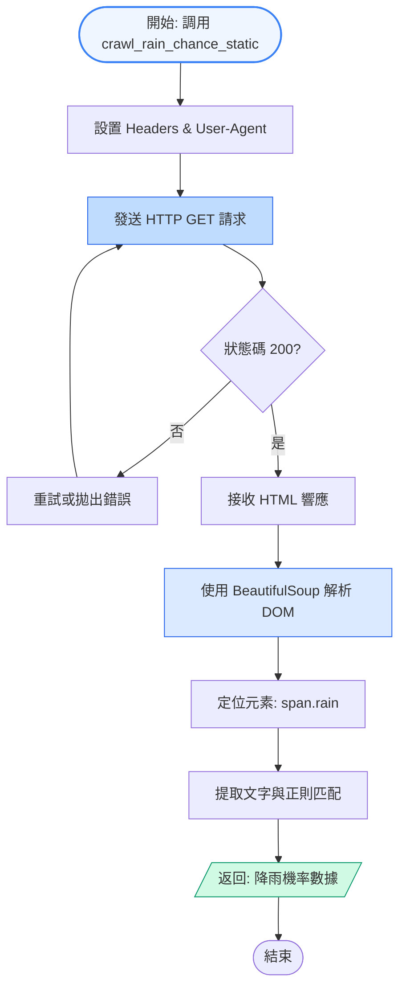
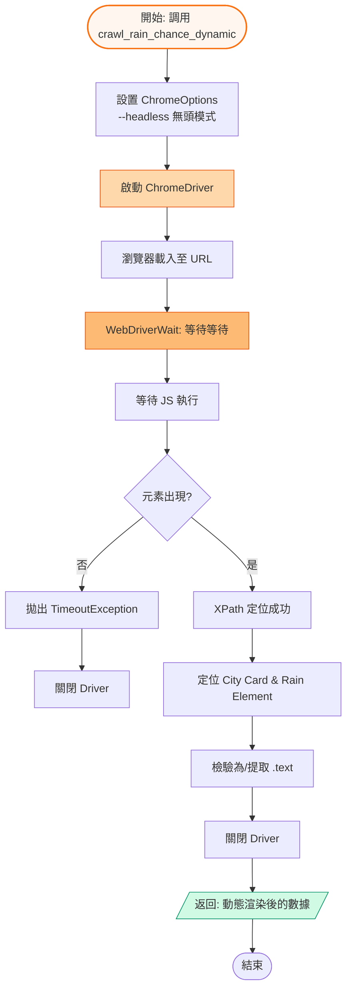

# umbrella_reminder

Simple automation that scrapes the Central Weather Administration county forecast, checks tomorrow's probability of rain for a chosen city, and sends an SMS alert when the chance exceeds a configured threshold.

## Features

- Headless Selenium + `webdriver-manager` to drive Chrome and parse the PoP value from the weekly forecast table.
- Twilio REST client to deliver a quick SMS reminder when the precipitation probability is high.
- Easy configuration for city name and rain-threshold percentage directly in `umbrella_reminder.py`.

## Technical Flow Comparison

This project demonstrates two common web scraping approaches:

### 1. Static Scraping Flow

Using **requests + BeautifulSoup** for fast, lightweight HTML parsing:



### 2. Dynamic Scraping Flow

Using **Selenium + ChromeDriver** to handle JavaScript-rendered content:



## Prerequisites

- Python 3.8+ with the following packages (install via `pip install selenium webdriver-manager twilio`).
- Google Chrome browser installed so `webdriver-manager` can download a compatible driver.
- A Twilio account with `Account SID`, `Auth Token`, and a Twilio-capable phone number.

## Setup

1. Copy the script to a location of your choice (already at `umbrella_reminder.py` in this repo).
2. Edit the placeholders in `textme()`:
   - `account_sid`
   - `auth_token`
   - `twilio_phone_number`
   - `your_phone_number`
3. Optionally adjust `TARGET_CITY` and `RAIN_THRESHOLD` at the bottom of the script.

## Running the script

```powershell
python umbrella_reminder.py
```

The script prints the rain probability and, if it meets or exceeds `RAIN_THRESHOLD`, sends an SMS through Twilio.

## Notes

- All instructions and additional context are documented in `ReadMe_umbrella_reminder.pdf`.
- Headless Chrome requires a matching driver; `webdriver-manager` handles this automatically but needs web access.
- Handle your Twilio credentials securely; do not commit real secrets into version control.

## 中文說明

本專案透過爬取中央氣象局的縣市預報頁面，自動判斷指定城市的明日降雨機率，若超過設定的閾值（百分比）就透過 Twilio 發送簡訊提醒。

### 功能

- 控制無頭 Chrome（Selenium + `webdriver-manager`）解析周預報表格，取出明天的雨機率。
- 使用 Twilio REST API 發送簡訊，提醒用戶記得帶雨具。
- `umbrella_reminder.py` 內可直接調整目標城市與降雨門檻值。

### 技術流程比較

本專案展示兩種常見的網頁爬取方法：

#### 1. 靜態爬取流程

使用 **requests + BeautifulSoup**，特點是速度快、資源少、直接讀取 HTTP 獲取 HTML 源碼。

詳細流程圖請參見上方英文版的 **Static Scraping Flow**。

#### 2. 動態爬取流程

使用 **Selenium + ChromeDriver**，與真實瀏覽器為，執行 JavaScript 以獲取動態渲染的內容。

詳細流程圖請參見上方英文版的 **Dynamic Scraping Flow**。

### 前置需求

- Python 3.8 以上，並安裝 `selenium webdriver-manager twilio` 套件。
- 需在系統裝有 Google Chrome，`webdriver-manager` 可自動下載對應的 WebDriver。
- 擁有 Twilio 帳號、Account SID、Auth Token 以及可發簡訊的電話號碼。

### 設定步驟

1. 遊戲目錄已有 `umbrella_reminder.py`。
2. `textme()` 函式中替換為自己的：
   - `account_sid`
   - `auth_token`
   - `twilio_phone_number`
   - `your_phone_number`
3. 根據需求調整底部的 `TARGET_CITY` 與 `RAIN_THRESHOLD`。

### 執行方式

```powershell
python umbrella_reminder.py
```

腳本會輸出雨機率，若達到或超過設定門檻，則使用 Twilio 發送提醒簡訊。

### 備註

- README.pdf（`ReadMe_umbrella_reminder.pdf`）有更多背景說明。
- `webdriver-manager` 需經網路下載對應的驅動。
- 請妥善管理 Twilio 憑證，不要把真實敏感資訊推到版本庫中。
